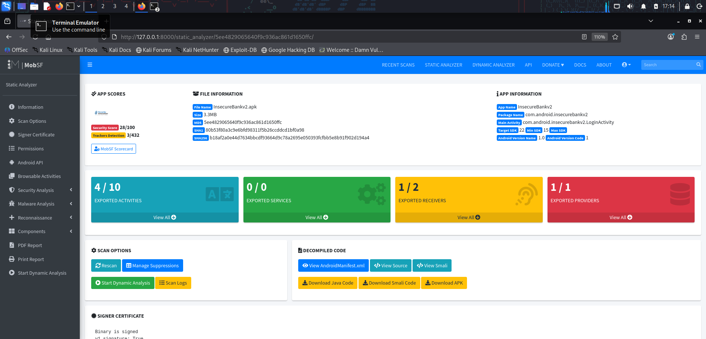
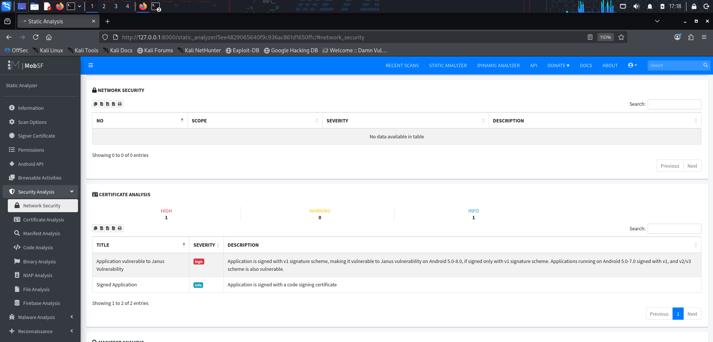
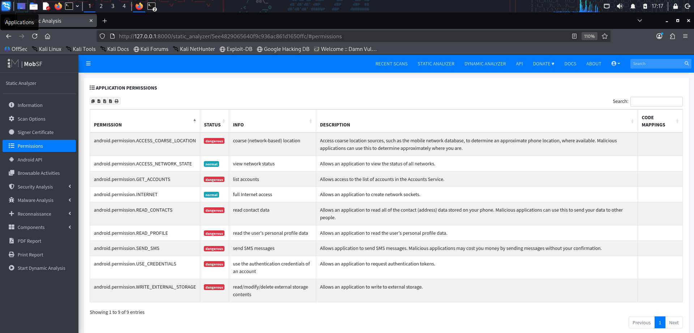
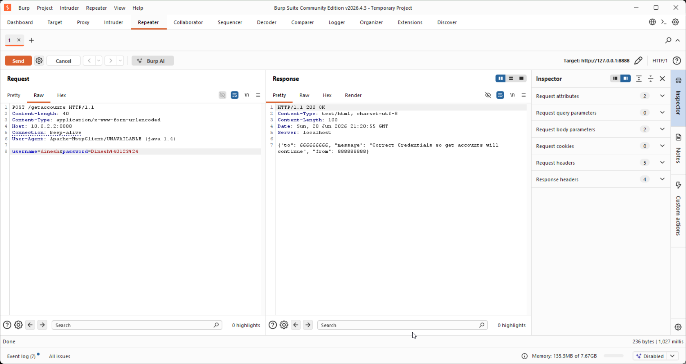
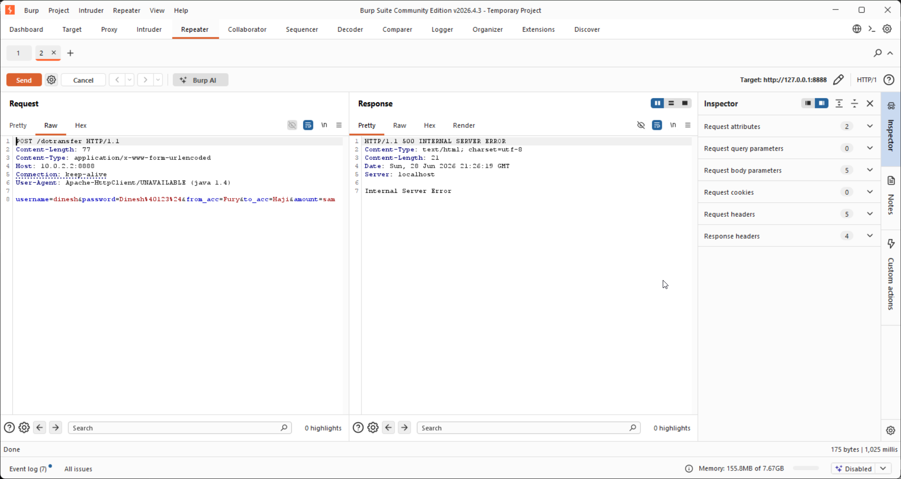

# 🏦 Implementing Security Measures for a Mobile Banking Application

## 📌 Project Overview

This project was completed as part of my Cybersecurity On-the-Job Training (OJT) at **Spinnaker Analytics**. The objective was to perform a comprehensive security assessment of the intentionally vulnerable Android banking application **InsecureBankv2** by combining static and dynamic security testing methodologies.

The assessment involved identifying common mobile application vulnerabilities, analyzing application behavior, intercepting network traffic, validating authentication mechanisms, and documenting security recommendations based on industry best practices.

---

## 🎯 Objectives

- Perform Static Application Security Testing (SAST)
- Perform Dynamic Application Security Testing (DAST)
- Analyze Android Manifest configuration
- Identify hardcoded secrets and insecure coding practices
- Assess authentication and authorization mechanisms
- Intercept and analyze HTTP requests using Burp Suite
- Evaluate network communication security
- Demonstrate common mobile application vulnerabilities
- Recommend security improvements aligned with OWASP and NIST guidance

---

## 🛠 Tools & Technologies

- MobSF (Mobile Security Framework)
- Burp Suite Community Edition
- Android Studio Emulator
- InsecureBankv2
- Java
- Android SDK
- Kali Linux
- Windows 11

---

## 🧪 Testing Environment

| Component | Details |
|-----------|---------|
| Operating System | Kali Linux & Windows 11 |
| Mobile Application | InsecureBankv2 |
| Emulator | Android Studio Emulator |
| Static Analysis | MobSF |
| Dynamic Analysis | Burp Suite |
| Testing Methodology | OWASP Mobile Security Testing Guide (MASTG) |

---

# 🔍 Security Assessment Performed

- ✔ Static Security Analysis
- ✔ Dynamic Security Testing
- ✔ Android Manifest Review
- ✔ Authentication Testing
- ✔ Login Request Analysis
- ✔ Password Change Verification
- ✔ HTTP Traffic Inspection
- ✔ Hardcoded Secret Detection
- ✔ Dangerous Permission Analysis
- ✔ IDOR Testing
- ✔ Backend Communication Testing

---

# 🚨 Vulnerability Summary

| Vulnerability | Severity | Status |
|--------------|----------|--------|
| Hardcoded Secrets | High | Identified |
| Plaintext HTTP Communication | High | Identified |
| Exported Activities | Medium | Identified |
| Dangerous Permissions | Medium | Identified |
| Manifest Misconfigurations | Medium | Identified |
| Authentication Weaknesses | Medium | Identified |
| Insecure Network Communication | High | Identified |

---

# 📸 Key Project Screenshots

## MobSF Static Analysis

---

## Hardcoded Secrets

---

## Manifest Analysis

---

## Dangerous Permissions

---

## Burp Suite Login Request

---

## HTTP Traffic Analysis

---

## IDOR Testing

---

## Modified Transfer Request

---

## Successful Authentication

---

# 🛡 Security Recommendations

- Implement HTTPS with TLS 1.3
- Remove hardcoded credentials
- Encrypt sensitive data using Android Keystore
- Implement Certificate Pinning
- Disable unnecessary exported components
- Apply secure authentication and session management
- Validate all user inputs
- Follow the OWASP Mobile Application Security Testing Guide (MASTG)

---

# 📄 Project Report

The complete project report is included in this repository.

**File:**

`Mobile_Banking_Security_Report.pdf`

---

# 📚 References

- OWASP Mobile Security Testing Guide (MASTG)
- OWASP Mobile Top 10
- NIST Cybersecurity Framework
- MobSF Documentation
- Burp Suite Documentation

---

# 🚀 Skills Demonstrated

- Mobile Application Security
- Static Analysis (SAST)
- Dynamic Analysis (DAST)
- Android Security
- Burp Suite
- MobSF
- HTTP Traffic Analysis
- Authentication Testing
- Vulnerability Assessment
- Secure Coding Review
- Mobile Penetration Testing
- Security Documentation

---

## 👨‍💻 Author

**Mohammad Haji**

Cybersecurity Analyst | Mobile Application Security | Vulnerability Assessment | Application Security
