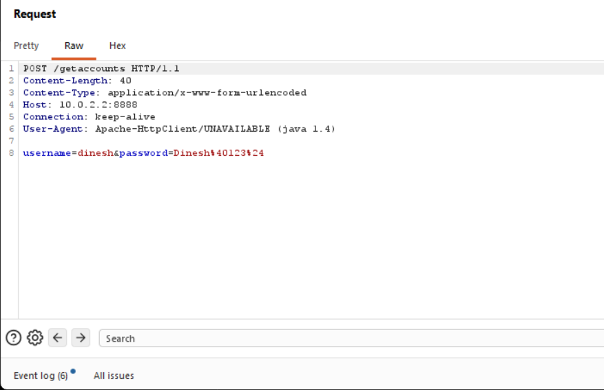
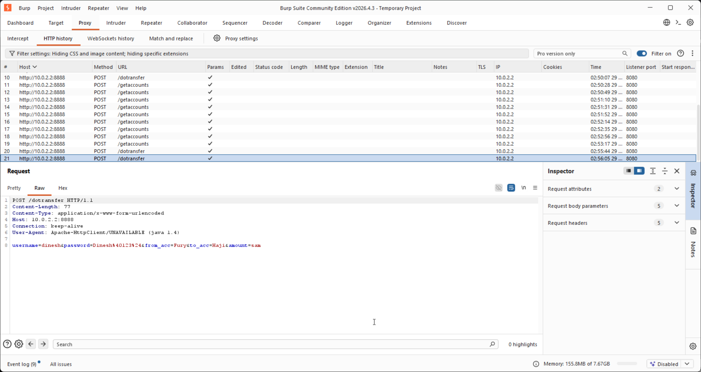
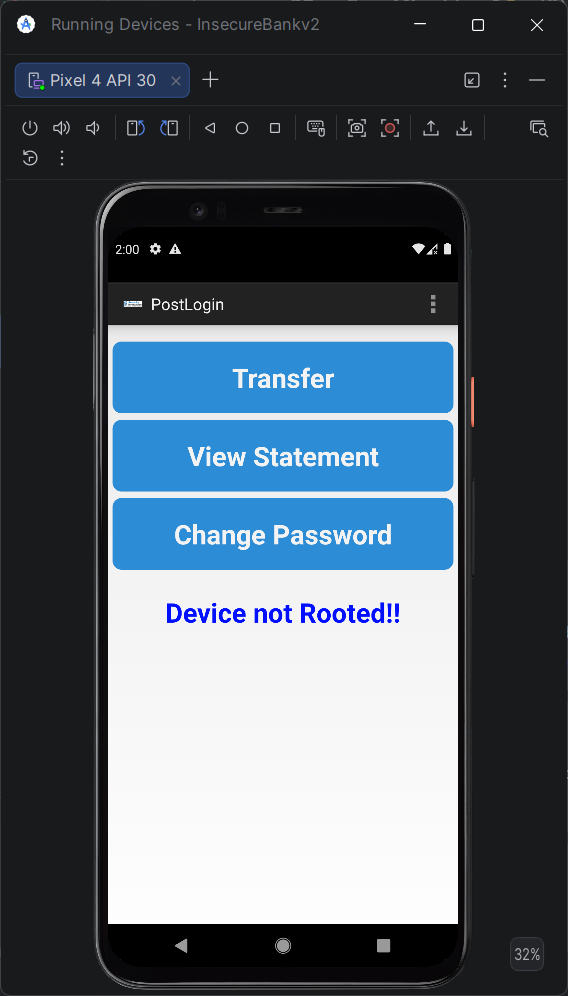

# 🏦 Implementing Security Measures for a Mobile Banking Application

> **Mobile Application Security Assessment of InsecureBankv2 using MobSF, Burp Suite, Android Emulator, and OWASP Mobile Security Testing Methodologies.**


---

# 📌 Project Overview

This project was completed as part of my **Cybersecurity On-the-Job Training (OJT)** at **Spinnaker Analytics**.

The objective was to perform a comprehensive security assessment of the intentionally vulnerable Android banking application **InsecureBankv2** by combining **Static Application Security Testing (SAST)** and **Dynamic Application Security Testing (DAST)**.

The assessment focused on identifying common mobile application vulnerabilities, reviewing Android application components, analyzing source code, intercepting network traffic, validating authentication mechanisms, and documenting remediation recommendations aligned with industry best practices.

---

# 🎯 Project Objectives

- Perform Static Application Security Testing (SAST)
- Perform Dynamic Application Security Testing (DAST)
- Analyze Android Manifest configuration
- Identify hardcoded secrets
- Review insecure coding practices
- Evaluate authentication and authorization mechanisms
- Intercept HTTP traffic using Burp Suite
- Analyze backend communication
- Demonstrate common Android security vulnerabilities
- Recommend security improvements aligned with OWASP MASTG and the NIST Cybersecurity Framework

---

# 🛠 Tools & Technologies

| Category | Tools |
|----------|------|
| Static Analysis | MobSF |
| Dynamic Analysis | Burp Suite Community Edition |
| Mobile Application | InsecureBankv2 |
| Emulator | Android Studio Emulator |
| Programming Language | Java |
| Mobile Platform | Android |
| Operating Systems | Kali Linux, Windows 11 |

---

# 🧪 Testing Environment

| Component | Details |
|-----------|---------|
| Operating System | Kali Linux & Windows 11 |
| Mobile Application | InsecureBankv2 |
| Android Emulator | Android Studio Emulator |
| Static Analysis | MobSF |
| Dynamic Analysis | Burp Suite |
| Methodology | OWASP Mobile Security Testing Guide (MASTG) |

---

# 🔬 Assessment Methodology

```
                InsecureBankv2 APK
                       │
                       ▼
          Static Analysis (MobSF)
                       │
                       ▼
        Android Manifest Review
                       │
                       ▼
        Source Code Analysis
                       │
                       ▼
 Dynamic Testing (Burp Suite + Emulator)
                       │
                       ▼
 Authentication & Authorization Testing
                       │
                       ▼
      Vulnerability Identification
                       │
                       ▼
      Security Recommendations
```

---

# 🔍 Security Assessment Performed

- ✔ Static Security Analysis
- ✔ Dynamic Security Testing
- ✔ Android Manifest Review
- ✔ Authentication Testing
- ✔ Password Change Verification
- ✔ Login Request Analysis
- ✔ HTTP Traffic Inspection
- ✔ Hardcoded Secret Detection
- ✔ Dangerous Permission Analysis
- ✔ IDOR Testing
- ✔ Backend Communication Analysis

---

# 🚨 Vulnerability Summary

| Vulnerability | Severity | OWASP Category | Recommended Remediation |
|--------------|----------|----------------|-------------------------|
| Hardcoded Secrets | High | Insecure Data Storage | Remove credentials from source code and use Android Keystore |
| Plaintext HTTP Communication | High | Insecure Communication | Enforce HTTPS with TLS 1.3 |
| Exported Activities | Medium | Platform Misconfiguration | Restrict exported components |
| Dangerous Permissions | Medium | Excessive Permissions | Request only required permissions |
| Manifest Misconfigurations | Medium | Security Configuration | Secure AndroidManifest configuration |
| Authentication Weaknesses | Medium | Authentication & Session Management | Strengthen authentication and session controls |
| Insecure Network Communication | High | Network Security | Encrypt all client-server communication |

---

# 📊 Assessment Results

| Metric | Result |
|---------|--------|
| Total Vulnerabilities Identified | 7 |
| High Severity | 3 |
| Medium Severity | 4 |
| Low Severity | 0 |
| Static Analysis Performed | ✅ |
| Dynamic Analysis Performed | ✅ |
| Authentication Testing | ✅ |
| Authorization Testing | ✅ |

---

# 📸 Key Project Screenshots

## MobSF Static Analysis Dashboard


---

## Hardcoded Secrets Detection


---

## Android Manifest Analysis


---

## Dangerous Permissions


---

## Burp Suite Login Request



---

## HTTP Traffic Analysis



---

## IDOR Testing


---

## Modified Transfer Request


---

## Successful Authentication



---

# 🛡 Security Recommendations

- Implement HTTPS with TLS 1.3
- Remove hardcoded credentials from source code
- Use Android Keystore for secure credential storage
- Implement SSL Certificate Pinning
- Restrict exported Android components
- Strengthen authentication and session management
- Validate all user inputs
- Encrypt sensitive data at rest
- Apply the OWASP Mobile Application Security Testing Guide (MASTG)
- Perform regular mobile application security assessments

---

# 📈 Project Outcomes

- Successfully conducted both **Static** and **Dynamic** mobile application security assessments.
- Identified multiple Android application vulnerabilities affecting authentication, network communication, and application configuration.
- Performed HTTP traffic interception and request analysis using Burp Suite.
- Evaluated authentication and authorization mechanisms, including IDOR testing.
- Produced a comprehensive security assessment report with remediation recommendations aligned with OWASP MASTG and the NIST Cybersecurity Framework.

---

# 💡 Key Learnings

During this project I strengthened my practical knowledge of:

- Mobile Application Security Assessment
- Android Application Architecture
- Static Application Security Testing (SAST)
- Dynamic Application Security Testing (DAST)
- Android Manifest Security Analysis
- Burp Suite Traffic Interception
- Authentication & Authorization Testing
- HTTP Request Analysis
- Secure Coding Practices
- Mobile Vulnerability Assessment
- Security Documentation & Reporting

---

# 📄 Project Report

The complete project documentation is included in this repository.

**Report:**

📄 `Mobile_Banking_Security_Report.pdf`

---

# 📚 References

- OWASP Mobile Security Testing Guide (MASTG)
- OWASP Mobile Top 10
- NIST Cybersecurity Framework
- MobSF Documentation
- Burp Suite Documentation
- Android Developers Security Documentation

---

# 🚀 Skills Demonstrated

- Mobile Application Security
- Android Security Testing
- Static Analysis (SAST)
- Dynamic Analysis (DAST)
- Mobile Penetration Testing
- Vulnerability Assessment
- Secure Coding Review
- Burp Suite
- MobSF
- HTTP Traffic Analysis
- Authentication Testing
- Authorization Testing
- Android Manifest Analysis
- Security Documentation

---

# ⚠️ Disclaimer

This project was conducted in a controlled laboratory environment using the intentionally vulnerable **InsecureBankv2** application for educational and training purposes only.

No unauthorized testing was performed against production systems or third-party applications.

---

# 👨‍💻 Author

**Mohammad Haji**

Cybersecurity Analyst | Mobile Application Security | Vulnerability Assessment | Application Security

**GitHub:** https://github.com/mohammadhaji7

**LinkedIn:** www.linkedin.com/in/mohammadhajiwork

---

⭐ **If you found this project useful, feel free to star the repository!**
